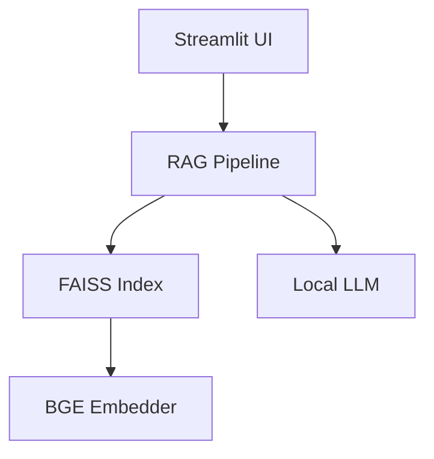

<div align="center">

# Financial Market Intelligence RAG

End-to-end Retrieval-Augmented Generation over 50K+ financial news — local LLM answers with verifiable citations.

[](https://www.python.org/)
[](https://pytorch.org/)
[](https://github.com/facebookresearch/faiss)
[](https://streamlit.io/)
[](https://www.docker.com/)

**Team project** · Maintained by [@amberfxy](https://github.com/amberfxy) (**Amber Fan**) with **Soonbee Hwang**

</div>

---

## Overview

Retrieves relevant financial news from a large corpus and generates grounded answers with a **local LLM** and clickable citations — aimed at accurate financial Q&A with less hallucination.



**Stack highlights:** BGE-Large embeddings · FAISS `IndexFlatL2` · Mistral 7B GGUF (local) · Streamlit UI · Docker

Related: GPU distance kernels in [vector-search-cuda](https://github.com/amberfxy/vector-search-cuda).

---

## Architecture / modules

- **data/**: Kaggle dataset loading & preprocessing scripts
- **src/data/**: Data loading and preprocessing
- **src/chunking/**: Semantic chunking utilities
- **src/embeddings/**: BGE-Large-en embedding generation (ONNX preferred, PyTorch fallback)
- **src/vectorstore/**: FAISS IndexFlatL2 vector store
- **src/rag/**: RAG pipeline and local LLM inference
- **ui/**: Streamlit UI for querying the system
- **scripts/**: Utility scripts for data processing
- **docker/**: Dockerfile + docker compose for deployment
- **models/**: Instructions for downloading local LLM models

---

## Dataset

[Daily News for Stock Market Prediction](https://www.kaggle.com/datasets/aaron7sun/stocknews) — 50,000+ financial news headlines (date + headline + body).

### Download

1. Install Kaggle CLI: `pip install kaggle`
2. Place `kaggle.json` in `~/.kaggle/`
3. Run:

```bash
./scripts/download_data.sh
```

Or manually:

```bash
cd data/raw
kaggle datasets download -d aaron7sun/stocknews
unzip stocknews.zip
```

---

## Setup

**Prerequisites:** Python 3.10+, Docker (optional), CUDA (optional for GPU)

```bash
git clone https://github.com/amberfxy/financial-market-intelligence-rag.git
cd financial-market-intelligence-rag
pip install -r requirements.txt
```

Download / export models (see `models/README.md`):

```bash
cd models
wget https://huggingface.co/TheBloke/Mistral-7B-Instruct-v0.1-GGUF/resolve/main/mistral-7b-instruct-v0.1.Q4_K_M.gguf
cd ..
python scripts/export_bge_onnx.py --verify   # optional, faster query embedding
```

Build or download the FAISS index:

```bash
# Option 1: build locally
python scripts/build_index.py

# Option 2: download pre-built index
gdown --id 1rYRlpdRHe48sCEwOfSfl39umRVpq0oq7 -O vectorstore/chunks.pkl &&
gdown --id 14U3eY6iN8_-NQmX_nw0hNH__I8ErQE8d -O vectorstore/faiss.index
```

---

## Run

**Streamlit (local):**

```bash
streamlit run ui/app.py
```

Open http://localhost:8501 → Initialize System → ask a question.

**Docker:**

```bash
docker build -t financial-rag-system .
docker compose up -d
```

---

## Usage

Example queries:

- "Why did NVDA stock fall after earnings?"
- "What were the main market trends in 2015?"
- "How did the financial crisis affect tech stocks?"

Features: local LLM inference, clickable citations, adjustable Top-K, latency display, expandable evidence.

---

## Technical details

| Component | Choice |
|-----------|--------|
| Embedding | BGE-Large-en-v1.5 (1024-d); ONNX Runtime preferred |
| Vector store | FAISS IndexFlatL2 |
| LLM | Mistral 7B Instruct GGUF via llama-cpp-python |
| Chunking | Sentence-level semantic chunking (~250 tokens) |
| Retrieval | Top-K exact L2 (L2-normalized ≈ cosine ranking) |

Performance targets: retrieval &lt;50ms · end-to-end &lt;1.5s · citations checked against sources.

---

## Project structure

```
.
├── data/                 # Raw / processed datasets
├── src/                  # Chunking, embeddings, FAISS, RAG
├── ui/app.py             # Streamlit app
├── scripts/              # Index build & data download
├── models/               # Local LLM weights
├── vectorstore/          # FAISS index files
├── Dockerfile
├── docker-compose.yml
└── requirements.txt
```

---

## Team

| Member | Notes |
|--------|------|
| **Amber Fan ([@amberfxy](https://github.com/amberfxy))** | Co-author; maintains this repository |
| **Soonbee Hwang** | Co-author |

---

## Troubleshooting

**Model not found** — download Mistral into `models/`; check path in `src/rag/llm.py`.  
**Index not found** — run `python scripts/build_index.py` or download pre-built files.  
**CUDA / GPU** — CPU works by default with llama-cpp-python; use CUDA builds for GPU (see Dockerfile).

---

## References

- Dataset: https://www.kaggle.com/datasets/aaron7sun/stocknews  
- BGE: https://huggingface.co/BAAI/bge-large-en-v1.5  
- Mistral GGUF: https://huggingface.co/TheBloke/Mistral-7B-Instruct-v0.1-GGUF  
- FAISS: https://github.com/facebookresearch/faiss  
